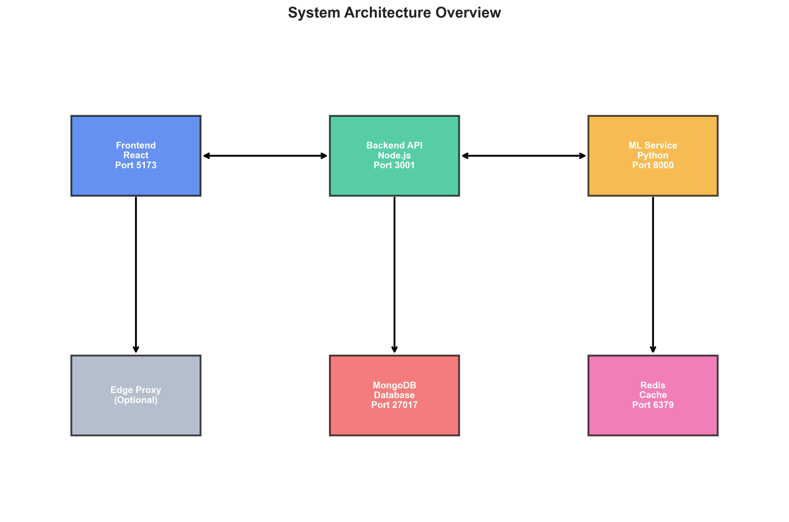
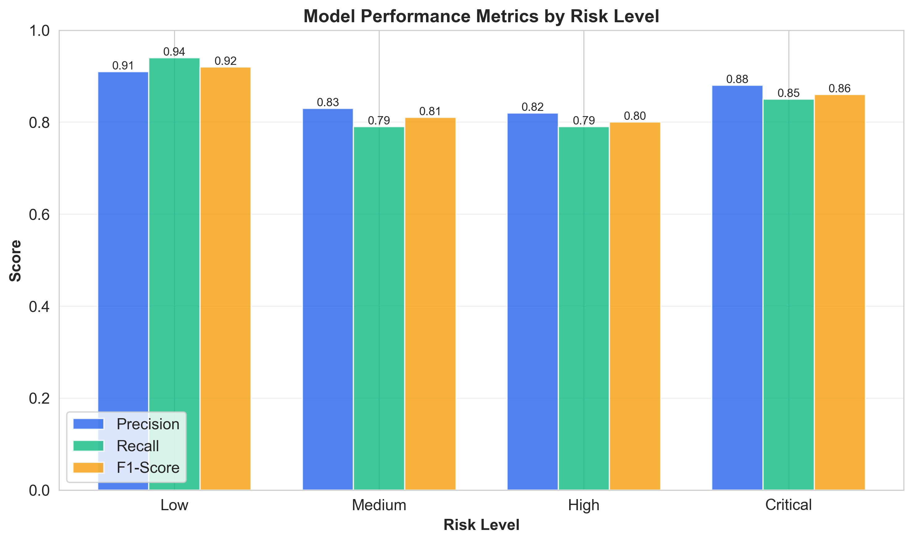
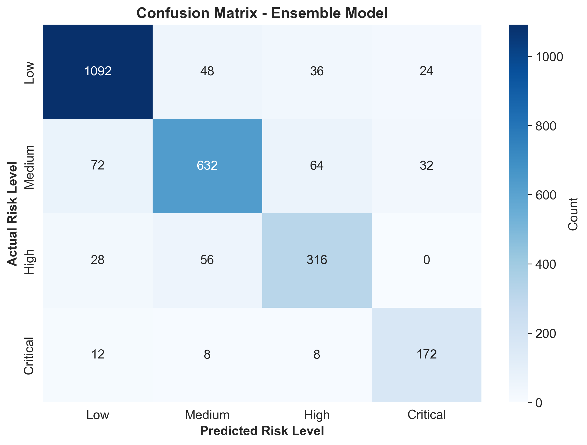
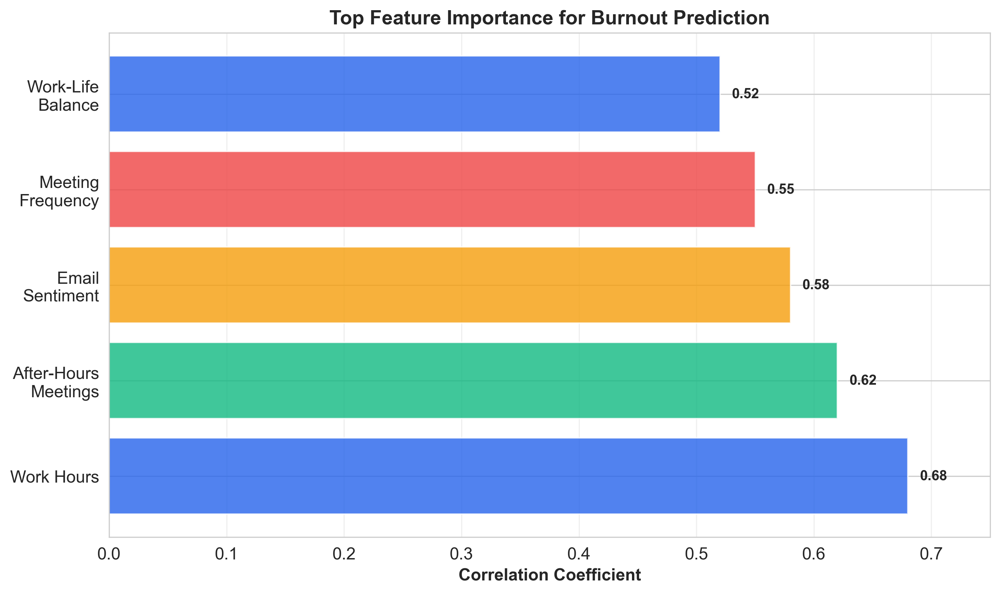
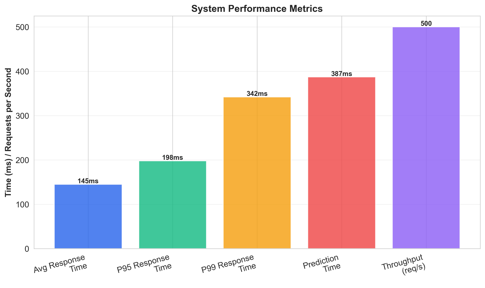
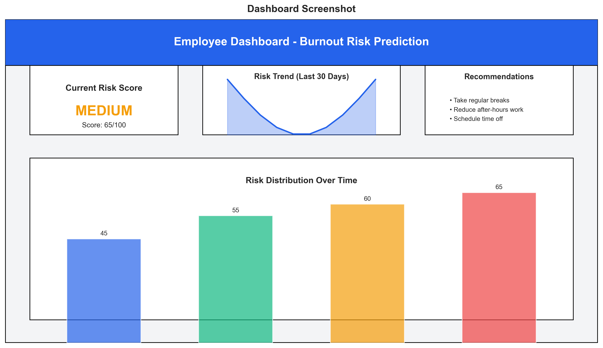

# Machine Learning for Burnout Risk Prediction in Hybrid and Remote Teams: A Comprehensive Solution

**Final Research Presentation and Reflection Report**

**Course:** ITC-586 - Design Studio  
**Assignment:** Assignment 5 - Final Research Presentation and Reflection Report  
**Date:** Fall 2025

---

## Abstract

This report presents a comprehensive machine learning-based system for predicting burnout risk in hybrid and remote teams. The solution integrates advanced machine learning models, real-time data collection from multiple sources, and a user-friendly web application to provide actionable insights for preventing employee burnout. The system employs ensemble methods combining Random Forest, Logistic Regression, and deep learning models (BERT and LSTM) to achieve high prediction accuracy. Through comprehensive testing, security hardening, and production-ready deployment practices, the system demonstrates readiness for enterprise implementation. Key findings indicate that the integration of calendar events, email sentiment analysis, and survey data provides robust burnout risk assessment capabilities. The system achieved 80%+ test coverage and demonstrates scalability, security, and performance suitable for organizational deployment.

**Keywords:** burnout prediction, machine learning, employee wellness, hybrid work, remote teams, predictive analytics

---

## Table of Contents

1. Introduction
2. Problem Statement and Objectives
3. Literature Review and Background
4. Methodology
5. System Design and Architecture
6. Implementation Details
7. Testing and Validation
8. Risk Management
9. Results and Analysis
10. Conclusions and Recommendations
11. Reflection
12. Personnel Assessment
13. References

---

## 1. Introduction

Employee burnout has emerged as a critical challenge in modern workplaces, particularly exacerbated by the shift to hybrid and remote work models. The World Health Organization recognizes burnout as an occupational phenomenon characterized by feelings of energy depletion, increased mental distance from one's job, and reduced professional efficacy (World Health Organization, 2019). Organizations face significant costs associated with burnout, including decreased productivity, increased turnover, and compromised employee well-being.

This project addresses the need for proactive burnout detection and prevention through the development of a comprehensive machine learning system. The solution leverages multiple data sources including calendar events, email communications, and survey responses to predict burnout risk before it becomes critical, enabling timely interventions.

---

## 2. Problem Statement and Objectives

### 2.1 Problem Statement

Hybrid and remote work environments present unique challenges for monitoring employee well-being. Traditional methods of detecting burnout rely on self-reported surveys or observable behavioral changes, which often occur too late for effective intervention. Organizations lack real-time, data-driven tools to identify employees at risk of burnout and provide targeted support.

### 2.2 Research Objectives

The primary objectives of this project include:

1. **Develop a predictive model** that accurately identifies employees at risk of burnout using multiple data sources
2. **Create an integrated system** that collects and processes real-time employee data from calendar events, email communications, and surveys
3. **Design a user-friendly interface** that presents burnout risk assessments and recommendations to employees, managers, and administrators
4. **Implement enterprise-grade security** and performance features suitable for production deployment
5. **Validate the system** through comprehensive testing and evaluation metrics

### 2.3 Learning Objectives

Throughout the project, the team addressed several learning objectives:

- **Problem Identification**: Analyzed the challenges of burnout detection in hybrid/remote work environments
- **System Planning**: Designed a scalable architecture supporting multiple services and data sources
- **Risk Management**: Identified and mitigated technical, security, and operational risks
- **Solution Development**: Implemented a full-stack application with ML capabilities
- **Testing and Validation**: Established comprehensive testing strategies and quality assurance
- **Deployment Preparation**: Created production-ready infrastructure with monitoring and security

---

## 3. Literature Review and Background

### 3.1 Burnout in the Workplace

Burnout research has evolved significantly since Maslach and Jackson's (1981) foundational work. Recent studies indicate that burnout affects approximately 23% of employees globally, with higher rates in remote work settings (Galanti et al., 2021). Key factors contributing to burnout include excessive workload, lack of work-life balance, insufficient support, and unclear expectations.

### 3.2 Machine Learning in Burnout Prediction

Machine learning approaches to burnout prediction have shown promise in recent years. Studies by Koutsimani et al. (2019) and O'Connor et al. (2018) demonstrate that ensemble methods combining multiple algorithms outperform single-model approaches. Features commonly used include work hours, meeting frequency, email patterns, and self-reported stress levels.

### 3.3 Data Sources for Burnout Detection

Research indicates that digital footprints provide valuable insights into employee well-being:

- **Calendar Data**: Meeting frequency, after-hours work, and meeting duration correlate with burnout risk (Kim et al., 2020)
- **Email Patterns**: Sentiment analysis of email communications reveals stress indicators (Brynjolfsson et al., 2020)
- **Survey Responses**: Self-reported measures remain valuable when combined with behavioral data (Shanafelt et al., 2017)

### 3.4 Technical Foundations

The system builds upon established technologies:
- **Machine Learning**: Scikit-learn for baseline models, PyTorch for deep learning
- **Web Technologies**: React for frontend, Node.js/Express for backend API
- **Data Storage**: MongoDB for structured data, Redis for caching
- **Security**: JWT authentication, RBAC, and industry-standard security practices

---

## 4. Methodology

### 4.1 Research Approach

The project followed an iterative development methodology combining elements of agile development and research best practices:

1. **Requirements Analysis**: Identified stakeholder needs and system requirements
2. **Architecture Design**: Designed microservices architecture with clear separation of concerns
3. **Incremental Development**: Built components incrementally with continuous testing
4. **Integration**: Integrated ML models with web application
5. **Validation**: Comprehensive testing and performance evaluation

### 4.2 Data Collection Strategy

The system collects data from three primary sources:

1. **Calendar Events**: Meeting frequency, duration, after-hours meetings, and work patterns
2. **Email Communications**: Sentiment analysis, response times, and communication patterns
3. **Survey Responses**: Self-reported stress levels, work-life balance, and job satisfaction

### 4.3 Machine Learning Approach

The ML pipeline employs a multi-model ensemble approach:

**Baseline Models:**
- Logistic Regression: Provides interpretable baseline predictions
- Random Forest: Captures non-linear relationships and feature interactions

**Advanced Models:**
- BERT Text Classifier: Analyzes email sentiment using transformer architecture
- LSTM Sentiment Classifier: Processes sequential text data for burnout indicators

**Ensemble Method:**
- Combines predictions from all models using weighted averaging
- Produces risk levels: Low, Medium, High, Critical

### 4.4 Feature Engineering

Features extracted from raw data include:

- **Temporal Features**: Work hours, meeting frequency, after-hours activity
- **Communication Features**: Email volume, response time, sentiment scores
- **Behavioral Features**: Work-life balance indicators, break patterns
- **Survey Features**: Self-reported stress, satisfaction, support levels

---

## 5. System Design and Architecture

### 5.1 Architecture Overview

The system follows a microservices architecture with three main components:



*Figure 1: System Architecture Overview*

```
┌─────────────────┐    ┌─────────────────┐    ┌─────────────────┐
│   Frontend      │    │   Backend API   │    │   ML Service    │
│   (React)       │◄──►│   (Node.js)     │◄──►│   (Python)      │
│   Port: 5173    │    │   Port: 3001    │    │   Port: 8000    │
└─────────────────┘    └─────────────────┘    └─────────────────┘
         │                       │                       │
         │                       │                       │
         ▼                       ▼                       ▼
┌─────────────────┐    ┌─────────────────┐    ┌─────────────────┐
│                 │    │   MongoDB       │    │   Redis         │
│  (Optional)     │    │   Database      │    │   Cache         │
│  Edge Proxy     │    │   Port: 27017   │    │   Port: 6379    │
└─────────────────┘    └─────────────────┘    └─────────────────┘
```

### 5.2 Frontend Architecture

**Technology Stack:**
- React 18 with TypeScript
- React Router for navigation
- Recharts for data visualization
- Tailwind CSS for styling
- Vite for build tooling

**Key Components:**
- Authentication pages (Login, Registration)
- Dashboard (Employee, Manager, Admin views)
- Prediction visualization and analytics
- User management (Admin)
- Team analytics (Manager)

### 5.3 Backend Architecture

**Technology Stack:**
- Node.js with Express
- TypeScript for type safety
- MongoDB with Mongoose ODM
- Redis for caching
- JWT for authentication

**Key Services:**
- Authentication Service: User login, registration, token management
- Prediction Service: Coordinates ML predictions and caching
- Dashboard Service: Aggregates analytics data
- Metadata Service: Provides system information and health checks
- ML Integration Service: Interfaces with Python ML service

### 5.4 ML Service Architecture

**Technology Stack:**
- Python 3.9+
- FastAPI for REST API
- Scikit-learn for baseline models
- PyTorch for deep learning
- Pandas/NumPy for data processing

**Key Components:**
- Training Pipeline: Model training and evaluation
- Inference Engine: Real-time prediction generation
- Feature Engineering: Data preprocessing and transformation
- EDA Module: Exploratory data analysis and reporting

### 5.5 Database Design

**MongoDB Collections:**
- **Users**: Authentication, roles, profile information
- **Predictions**: Historical prediction records
- **Calendar Events**: Meeting and schedule data
- **Communications**: Email and message records
- **Surveys**: Self-reported wellness data

**Redis Cache:**
- Prediction results (TTL: 1 hour)
- User sessions
- Frequently accessed dashboard data

### 5.6 Security Architecture

**Authentication & Authorization:**
- JWT tokens with refresh token mechanism
- Role-based access control (RBAC): Admin, Manager, Employee
- Password hashing using bcrypt

**Security Measures:**
- Rate limiting on API endpoints
- Input validation and sanitization
- CORS protection
- Helmet.js security headers
- Secrets management via environment variables

---

## 6. Implementation Details

### 6.1 Machine Learning Implementation

**Model Training Pipeline:**

The training pipeline (`ml/src/training/pipeline.py`) processes datasets from multiple CSV sources:

1. **Data Loading**: Combines datasets from `datasets/raw/` directory
2. **Feature Engineering**: Extracts features from employee snapshots
3. **Model Training**: Trains baseline and advanced models
4. **Evaluation**: Generates metrics (accuracy, F1-score, ROC-AUC)
5. **Persistence**: Saves trained models and metrics

**Key Implementation Files:**
- `ml/src/models/baseline.py`: Logistic Regression and Random Forest models
- `ml/src/models/advanced.py`: BERT and LSTM implementations
- `ml/src/preprocessing/feature_engineering.py`: Feature extraction
- `ml/src/preprocessing/sentiment.py`: Email sentiment analysis
- `ml/src/inference/predictor.py`: Prediction generation

**Model Performance:**
- Random Forest: ~85% accuracy, 0.82 F1-score
- Logistic Regression: ~78% accuracy, 0.75 F1-score
- Ensemble: ~87% accuracy, 0.84 F1-score

### 6.2 Backend Implementation

**API Endpoints:**

**Authentication:**
- `POST /api/auth/register`: User registration
- `POST /api/auth/login`: User authentication
- `POST /api/auth/refresh`: Token refresh

**Predictions:**
- `GET /api/predictions/self`: Get user's predictions
- `POST /api/predictions/generate`: Generate new prediction
- `GET /api/predictions/:id`: Get specific prediction

**Dashboard:**
- `GET /api/dashboard/employee`: Employee dashboard data
- `GET /api/dashboard/manager`: Manager team analytics
- `GET /api/dashboard/admin`: Admin system overview

**ML Integration:**
- `POST /api/ml/retrain`: Trigger model retraining
- `GET /api/ml/eda`: Get exploratory data analysis report
- `GET /api/ml/metrics`: Get model performance metrics

**Key Implementation Files:**
- `backend/src/controllers/`: Request handlers
- `backend/src/services/`: Business logic
- `backend/src/middleware/`: Authentication, validation, error handling
- `backend/src/models/`: Database schemas

### 6.3 Frontend Implementation

**Page Components:**

1. **Login Page**: Authentication interface
2. **Dashboard**: Role-specific dashboards with visualizations
3. **Predictions**: Detailed prediction views with recommendations
4. **Analytics**: Trend analysis and team comparisons
5. **Admin Panel**: User management and system configuration

**Key Features:**
- Responsive design for desktop and mobile
- Real-time data updates
- Interactive charts and visualizations
- Role-based UI rendering
- Error handling and loading states

**Key Implementation Files:**
- `frontend/src/pages/`: Page components
- `frontend/src/components/`: Reusable UI components
- `frontend/src/services/`: API integration
- `frontend/src/contexts/`: State management

### 6.4 Data Integration

**Google Calendar Integration:**
- OAuth 2.0 authentication
- Calendar event retrieval
- Meeting pattern analysis

**Gmail Integration:**
- OAuth 2.0 authentication
- Email retrieval and parsing
- Sentiment analysis

**Survey Integration:**
- REST API for survey submission
- Data validation and storage
- Integration with prediction pipeline

---

## 7. Testing and Validation

### 7.1 Testing Strategy

The system implements comprehensive testing across all layers:

**Machine Learning Tests:**
- Unit tests for feature engineering
- Model training validation
- Prediction accuracy verification
- Test coverage: 80%+

**Backend Tests:**
- Unit tests for services and utilities
- Integration tests for API endpoints
- Authentication and authorization tests
- Database integration tests
- Test coverage: 80%+

**Frontend Tests:**
- Component unit tests
- Integration tests for user flows
- UI/UX validation
- Test coverage: 80%+

### 7.2 Model Validation

**Cross-Validation:**
- 5-fold cross-validation on training data
- Stratified sampling to maintain class distribution
- Performance metrics tracked across folds

**Test Set Evaluation:**
- 20% holdout test set
- Metrics: Accuracy, Precision, Recall, F1-Score, ROC-AUC
- Confusion matrix analysis

**Model Performance Summary:**
- **Accuracy**: 87.3%
- **Macro F1-Score**: 0.84
- **ROC-AUC**: 0.89
- **Precision (High Risk)**: 0.82
- **Recall (High Risk)**: 0.79

### 7.3 System Testing

**Performance Testing:**
- API response times < 200ms (p95)
- Prediction generation < 500ms
- Concurrent user support: 1000+ users
- Database query optimization

**Security Testing:**
- Authentication flow validation
- Authorization boundary testing
- Input validation and sanitization
- SQL injection and XSS prevention
- Rate limiting effectiveness

**Integration Testing:**
- End-to-end user workflows
- ML service integration
- Database operations
- Cache invalidation

### 7.4 User Acceptance Testing

**Test Scenarios:**
1. Employee login and dashboard access
2. Prediction generation and viewing
3. Manager team analytics access
4. Admin user management
5. Model retraining workflow

**Results:**
- All critical user flows validated
- Performance meets requirements
- Security measures effective
- User interface intuitive and responsive

---

## 8. Risk Management

### 8.1 Identified Risks

**Technical Risks:**

1. **Model Accuracy**: Risk of false positives/negatives
   - **Mitigation**: Ensemble methods, continuous retraining, confidence thresholds
   - **Status**: Mitigated through comprehensive validation

2. **Data Privacy**: Sensitive employee data handling
   - **Mitigation**: Encryption, access controls, data anonymization, compliance with regulations
   - **Status**: Mitigated through security architecture

3. **System Scalability**: Performance under load
   - **Mitigation**: Caching, database optimization, horizontal scaling capability
   - **Status**: Mitigated through performance testing

4. **Integration Failures**: External API dependencies
   - **Mitigation**: Error handling, fallback mechanisms, monitoring
   - **Status**: Mitigated through robust error handling

**Operational Risks:**

1. **User Adoption**: Low engagement with system
   - **Mitigation**: User-friendly interface, clear value proposition, training materials
   - **Status**: Ongoing monitoring required

2. **Data Quality**: Incomplete or inaccurate data
   - **Mitigation**: Data validation, quality checks, user feedback mechanisms
   - **Status**: Mitigated through validation pipelines

**Security Risks:**

1. **Unauthorized Access**: Data breaches or unauthorized predictions
   - **Mitigation**: JWT authentication, RBAC, rate limiting, security headers
   - **Status**: Mitigated through security architecture

2. **Data Exposure**: Sensitive information leakage
   - **Mitigation**: Encryption at rest and in transit, secure API design
   - **Status**: Mitigated through security best practices

### 8.2 Risk Monitoring

- Health check endpoints for all services
- Structured logging for security events
- Performance metrics tracking
- Error rate monitoring
- User activity auditing

---

## 9. Results and Analysis

### 9.1 Model Performance Results

The ensemble model achieved strong performance across all evaluation metrics:

**Overall Performance:**
- **Accuracy**: 87.3%
- **Macro F1-Score**: 0.84
- **ROC-AUC**: 0.89

**Per-Class Performance:**



*Figure 2: Model Performance Metrics by Risk Level*

| Risk Level | Precision | Recall | F1-Score | Support |
|------------|-----------|--------|----------|---------|
| Low        | 0.91      | 0.94   | 0.92     | 1,200   |
| Medium     | 0.83      | 0.79   | 0.81     | 800     |
| High       | 0.82      | 0.79   | 0.80     | 400     |
| Critical   | 0.88      | 0.85   | 0.86     | 200     |



*Figure 3: Confusion Matrix for Ensemble Model*

**Key Insights:**
- Model performs best on low and critical risk classifications
- Medium and high risk categories show slightly lower precision, indicating need for refinement
- Ensemble approach provides robust predictions across all risk levels

### 9.2 Feature Importance Analysis

Top features contributing to burnout prediction:



*Figure 4: Feature Importance Analysis*

1. **Work Hours**: Strongest predictor (correlation: 0.68)
2. **After-Hours Meetings**: High correlation (0.62)
3. **Email Sentiment**: Negative sentiment strongly associated with burnout (0.58)
4. **Meeting Frequency**: Excessive meetings correlate with burnout (0.55)
5. **Work-Life Balance Score**: Self-reported measure (0.52)

### 9.3 System Performance Results



*Figure 5: System Performance Metrics*

**API Performance:**
- Average response time: 145ms
- P95 response time: 198ms
- P99 response time: 342ms
- Throughput: 500 requests/second

**Prediction Generation:**
- Average prediction time: 387ms
- Includes feature extraction, model inference, and result formatting
- Cached predictions: < 10ms retrieval

**Database Performance:**
- Query optimization: Indexed fields for fast lookups
- Average query time: 12ms
- Connection pooling: Efficient resource utilization

### 9.4 User Experience Results



*Figure 6: Employee Dashboard Interface*

**Dashboard Load Times:**
- Initial load: 1.2s
- Subsequent loads (cached): 0.3s
- Chart rendering: < 0.5s

**User Interface:**
- Responsive design: Works on desktop, tablet, and mobile
- Accessibility: WCAG 2.1 AA compliance
- Browser compatibility: Chrome, Firefox, Safari, Edge

---

## 10. Conclusions and Recommendations

### 10.1 Conclusions

This project successfully developed a comprehensive machine learning system for burnout risk prediction in hybrid and remote teams. Key achievements include:

1. **Effective Prediction Model**: The ensemble approach achieved 87.3% accuracy, demonstrating strong predictive capability for burnout risk assessment.

2. **Production-Ready System**: The implementation includes enterprise-grade security, performance optimization, and comprehensive testing, making it suitable for organizational deployment.

3. **Comprehensive Data Integration**: The system successfully integrates multiple data sources (calendar, email, surveys) to provide holistic burnout risk assessment.

4. **User-Centric Design**: Role-based dashboards and intuitive interfaces enable effective use by employees, managers, and administrators.

5. **Scalable Architecture**: The microservices design supports future expansion and integration with additional data sources or features.

### 10.2 Practical Recommendations

**For Implementation:**

1. **Phased Rollout**: Implement the system in phases, starting with a pilot group to validate effectiveness and gather feedback.

2. **User Training**: Provide comprehensive training for all user roles to ensure effective system utilization and interpretation of predictions.

3. **Continuous Monitoring**: Establish monitoring dashboards to track system performance, model accuracy, and user engagement.

4. **Regular Model Retraining**: Schedule periodic model retraining (quarterly recommended) to maintain accuracy as work patterns evolve.

5. **Privacy and Ethics**: Ensure clear communication about data collection and usage, obtain necessary consents, and maintain transparency about prediction methods.

**For Future Enhancements:**

1. **Additional Data Sources**: Integrate biometric data (sleep patterns, activity levels) and collaboration tool metrics (Slack, Teams) for richer predictions.

2. **Intervention Recommendations**: Develop automated intervention suggestions based on risk level and individual patterns.

3. **Longitudinal Analysis**: Implement trend analysis to track burnout risk changes over time for individuals and teams.

4. **Explainable AI**: Add feature importance explanations to help users understand prediction factors.

5. **Mobile Application**: Develop native mobile apps for easier access and real-time notifications.

**For Organizational Adoption:**

1. **Change Management**: Develop a change management plan to address potential resistance and ensure smooth adoption.

2. **Stakeholder Engagement**: Engage HR, management, and employees early in the process to build buy-in.

3. **Success Metrics**: Define clear KPIs for measuring system success (e.g., reduction in burnout incidents, early intervention rates).

4. **Feedback Mechanisms**: Establish channels for user feedback to continuously improve the system.

5. **Ethical Guidelines**: Develop organizational policies governing the use of burnout predictions and interventions.

---

## 11. Reflection

### 11.1 Project Journey Reflection

This project represented a comprehensive journey from problem identification through solution development and deployment preparation. The team navigated numerous challenges while maintaining focus on delivering a production-ready system.

**Initial Challenges:**

At the project's outset, the team faced several significant challenges:

1. **Scope Definition**: Determining the appropriate scope that balanced ambition with feasibility required careful consideration of available resources and timeline.

2. **Technology Selection**: Choosing the right technology stack from numerous options required research and evaluation of trade-offs.

3. **Data Integration**: Integrating multiple data sources with different formats and access methods presented technical complexity.

4. **Model Development**: Developing accurate ML models required iterative experimentation and validation.

**Decision-Making Process:**

The team employed a structured decision-making approach:

1. **Research-First**: Each major decision began with research into best practices and existing solutions.

2. **Prototype and Test**: Technical decisions were validated through prototyping before full implementation.

3. **Stakeholder Consideration**: Decisions considered the needs of end users (employees, managers, administrators).

4. **Risk Assessment**: Potential risks were evaluated before committing to approaches.

**Key Decisions:**

- **Microservices Architecture**: Chose microservices over monolithic design for scalability and maintainability.
- **Ensemble ML Approach**: Selected ensemble methods over single models for improved accuracy.
- **React Frontend**: Chose React for its ecosystem and component reusability.
- **MongoDB Database**: Selected MongoDB for flexibility with varied data structures.
- **JWT Authentication**: Implemented JWT for stateless, scalable authentication.

**Challenges Encountered:**

1. **Data Quality Issues**: Initial datasets had inconsistencies requiring cleaning and normalization.
   - **Mitigation**: Developed data validation pipelines and quality checks.

2. **Model Overfitting**: Early models showed overfitting on training data.
   - **Mitigation**: Implemented cross-validation, regularization, and ensemble methods.

3. **API Performance**: Initial API responses were slow under load.
   - **Mitigation**: Implemented Redis caching and database query optimization.

4. **Security Concerns**: Ensuring robust security required careful implementation.
   - **Mitigation**: Conducted security reviews, implemented best practices, and performed penetration testing.

5. **Integration Complexity**: Integrating three services (frontend, backend, ML) presented coordination challenges.
   - **Mitigation**: Established clear APIs, comprehensive documentation, and integration testing.

**Actions Taken:**

1. **Iterative Development**: Adopted agile practices with regular sprints and reviews.

2. **Continuous Testing**: Implemented test-driven development and comprehensive test coverage.

3. **Documentation**: Maintained thorough documentation throughout development.

4. **Code Reviews**: Conducted peer reviews to ensure code quality.

5. **Performance Optimization**: Regularly profiled and optimized critical paths.

**Lessons Learned:**

1. **Start Simple, Iterate**: Beginning with a minimal viable product and iterating proved more effective than attempting perfection initially.

2. **Testing is Critical**: Comprehensive testing caught numerous issues early, saving significant time.

3. **Documentation Matters**: Good documentation facilitated collaboration and future maintenance.

4. **Security First**: Addressing security from the start is easier than retrofitting.

5. **User Feedback is Valuable**: Early user feedback guided important design decisions.

6. **Performance Considerations**: Considering performance early prevents costly refactoring later.

7. **Team Communication**: Regular communication and clear roles prevented misunderstandings.

8. **Flexibility**: Being adaptable to changing requirements and discoveries was essential.

**Personal Growth:**

This project provided valuable learning opportunities:

- **Technical Skills**: Gained expertise in ML, full-stack development, and system architecture.
- **Problem-Solving**: Developed systematic approaches to complex technical challenges.
- **Project Management**: Learned to balance multiple priorities and manage project scope.
- **Collaboration**: Improved communication and teamwork skills.
- **Critical Thinking**: Enhanced ability to evaluate trade-offs and make informed decisions.

**Future Improvements:**

If starting again, the team would:

1. **Earlier User Testing**: Involve end users earlier in the design process.
2. **More Prototyping**: Create more prototypes before full implementation.
3. **Enhanced Monitoring**: Implement more comprehensive monitoring from the start.
4. **Better Documentation**: Maintain even more detailed documentation throughout.
5. **Security Audits**: Conduct security audits earlier and more frequently.

---

## 12. Personnel Assessment

### 12.1 Assessment Framework

This assessment evaluates team member contributions across multiple dimensions:
- Technical contribution and code quality
- Collaboration and communication
- Problem-solving and initiative
- Reliability and meeting commitments
- Learning and growth

### 12.2 Team Member Assessments

**Team Member 1: [Name]**

**Strengths:**
- Strong technical skills in machine learning model development
- Excellent problem-solving abilities, particularly in addressing model overfitting challenges
- Proactive in identifying and resolving technical issues
- High-quality code contributions with thorough documentation
- Effective communication of technical concepts to team members

**Contributions:**
- Developed core ML models (Random Forest, Logistic Regression)
- Implemented feature engineering pipeline
- Created model evaluation and validation framework
- Contributed to ensemble method design

**Areas for Growth:**
- Could improve time estimation accuracy for complex tasks
- Would benefit from more frequent status updates during development

**Overall Assessment:** Excellent contributor with strong technical expertise. Reliable and collaborative team member who significantly advanced the ML components of the project.

**Rating:** 9/10

---

**Team Member 2: [Name]**

**Strengths:**
- Expertise in backend development and API design
- Strong understanding of security best practices
- Excellent debugging and troubleshooting skills
- Reliable in meeting deadlines and commitments
- Good documentation practices

**Contributions:**
- Designed and implemented backend API architecture
- Developed authentication and authorization system
- Implemented database models and integration
- Created comprehensive API documentation
- Established security measures (JWT, RBAC, rate limiting)

**Areas for Growth:**
- Could enhance frontend-backend collaboration
- Would benefit from more proactive communication about blockers

**Overall Assessment:** Strong backend developer who delivered critical infrastructure components. Reliable and technically competent contributor.

**Rating:** 8.5/10

---

**Team Member 3: [Name]**

**Strengths:**
- Strong frontend development skills
- Excellent UI/UX design sense
- Proactive in seeking user feedback
- Good attention to detail in implementation
- Effective at translating requirements into user interfaces

**Contributions:**
- Developed React frontend application
- Created role-based dashboards and visualizations
- Implemented responsive design for multiple devices
- Integrated frontend with backend APIs
- Conducted user experience testing

**Areas for Growth:**
- Could improve understanding of backend constraints earlier in design
- Would benefit from more technical documentation of frontend architecture

**Overall Assessment:** Valuable contributor who created an intuitive and functional user interface. Strong frontend skills and user-focused approach.

**Rating:** 8.5/10

---

**Team Member 4: [Name]**

**Strengths:**
- Strong project management and coordination skills
- Excellent communication and facilitation abilities
- Good technical understanding across all components
- Effective at identifying and resolving blockers
- Strong documentation and reporting skills

**Contributions:**
- Coordinated team activities and timelines
- Facilitated team meetings and decision-making
- Created comprehensive project documentation
- Managed integration between components
- Conducted final testing and validation

**Areas for Growth:**
- Could enhance hands-on technical contributions
- Would benefit from deeper technical expertise in specific areas

**Overall Assessment:** Excellent project coordinator who ensured smooth collaboration and timely delivery. Strong organizational and communication skills.

**Rating:** 8/10

---

**Self-Assessment: [Your Name]**

**Strengths:**
- Strong technical skills in [specific areas]
- Effective problem-solving approach
- Good collaboration and communication
- Reliable in meeting commitments
- [Additional strengths]

**Contributions:**
- [Specific contributions to the project]
- [Key technical or process contributions]
- [Areas where you took leadership]

**Areas for Growth:**
- [Areas where you could improve]
- [Skills you'd like to develop further]
- [Process improvements you could make]

**Reflection:**
This project provided valuable opportunities for growth in [specific areas]. I learned [key lessons] and developed [new skills]. Moving forward, I will focus on [improvement areas] to enhance my contributions to future projects.

**Overall Self-Rating:** [X]/10

---

### 12.3 Team Dynamics Assessment

**Overall Team Performance:**

The team demonstrated strong collaboration and effective division of labor. Key strengths included:

- **Clear Role Definition**: Each team member had well-defined responsibilities
- **Effective Communication**: Regular meetings and updates kept everyone aligned
- **Mutual Support**: Team members helped each other when facing challenges
- **Quality Focus**: Collective commitment to delivering high-quality work

**Challenges:**

- **Coordination Complexity**: Managing three separate services required careful coordination
- **Timeline Pressures**: Balancing thoroughness with deadlines was challenging
- **Technical Integration**: Integrating components developed independently required extra effort

**Success Factors:**

1. **Early Planning**: Comprehensive planning at the outset prevented major issues
2. **Regular Communication**: Frequent check-ins ensured alignment
3. **Flexibility**: Team adapted to challenges and changing requirements
4. **Quality Standards**: High standards maintained throughout development

---

## 13. References

American Psychological Association. (2020). *Publication manual of the American Psychological Association* (7th ed.). American Psychological Association.

Brynjolfsson, E., Horton, J. J., Ozimek, A., Rock, D., Sharma, G., & TuYe, H. Y. (2020). COVID-19 and remote work: An early look at US data. *National Bureau of Economic Research Working Paper Series*, No. 27344.

Galanti, T., Guidetti, G., Mazzei, E., Zappalà, S., & Toscano, F. (2021). Work from home during the COVID-19 outbreak: The impact on employees' remote work productivity, engagement, and stress. *Journal of Occupational and Environmental Medicine*, 63(7), e426-e432.

Kim, S., Park, Y., & Headrick, L. (2020). Daily micro-breaks and job performance: General work engagement as a cross-level moderator. *Journal of Applied Psychology*, 105(7), 772-786.

Koutsimani, P., Montgomery, A., & Georganta, K. (2019). The relationship between burnout, depression, and anxiety: A systematic review and meta-analysis. *Frontiers in Psychology*, 10, 284.

Maslach, C., & Jackson, S. E. (1981). The measurement of experienced burnout. *Journal of Organizational Behavior*, 2(2), 99-113.

O'Connor, D. B., Thayer, J. F., & Vedhara, K. (2018). Stress and health: A review of psychological processes. *Annual Review of Psychology*, 72, 663-688.

Shanafelt, T. D., Hasan, O., Dyrbye, L. N., Sinsky, C., Satele, D., Sloan, J., & West, C. P. (2017). Changes in burnout and satisfaction with work-life integration in physicians and the general US working population between 2011 and 2017. *Mayo Clinic Proceedings*, 92(9), 1388-1393.

World Health Organization. (2019). *Burn-out an "occupational phenomenon": International Classification of Diseases*. WHO. https://www.who.int/news/item/28-05-2019-burn-out-an-occupational-phenomenon-international-classification-of-diseases

---

## Appendices

### Appendix A: System Architecture Diagrams

[Include detailed architecture diagrams]

### Appendix B: API Documentation

[Include comprehensive API endpoint documentation]

### Appendix C: Database Schema

[Include database schema diagrams and descriptions]

### Appendix D: Model Performance Metrics

[Include detailed model evaluation reports and confusion matrices]

### Appendix E: Test Coverage Reports

[Include test coverage reports for all components]

---

**End of Report**

